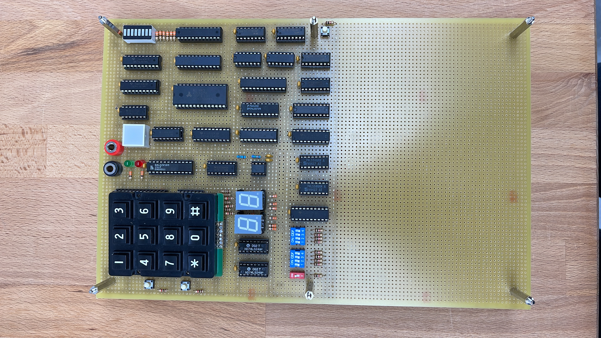

# Bingo implemented with ICs
Simplified Bingo game for two players only using simple ICs (combinational logic ICs, RAM IC, ROM IC, register ICs) and a programmable GAL for the most complex combinational logic operations of the project's state machine. The system uses a single NE555 chip as a clock. 

Before implementing the board, a detailed simulation was created using "Proteus" desktop app and many tests were run in the simulation. Once the simulation was validated, the circuit design schematic was created using "EasyEDA", with lots of labels for easy understanding and debugging. This schematic was used as step by step instructions during the final board soldering process. 

A lot of time went into making the components distribution visually appealing and as aligned as possible :)

## Board images

## Game instructions
1) The "PCI" push button is clicked, erasing all prior data. 

2) 8 two digit numbers are entered for the first player, and then another 8 for the second player. This numbers are the ones that will be in each player's bingo number card. 

3) The "#"" key is pressed, and the game starts

4) The red switch is used to select wether the generated numbers will be random (off position) or will be chosen by the user (on position). If the latter, the user must use the 8 blue switches to input the number (in binary) that he wants to be chosen.

5) The "Next" push button is clicked and held during approximately 1 second. When it is released, the random or user chosen number will be displayed.

6) If the displayed number matches with one that is in a player's bingo number card, a new LED will turn on in the LED array. This LED array alternates between each player's bingo card in 1 second intervals.

7) The "Next" push button is clicked until every number in one of the player's bingo number card has been chosen. When this happens, the big square LED will stop flashing, indicating that player 1 has won if OFF and that player 2 has won if ON. 

8) The "PCI" button can be pressed to restart the game

## Video demo
https://www.youtube.com/watch?v=60vZHOAxbzk&ab_channel=PolValero

## Circuit design

## System state machine

# Authors
[Pol Valero] (https://github.com/pol-valero) 

[Angel Garcia] (https://github.com/TheAngel11)
